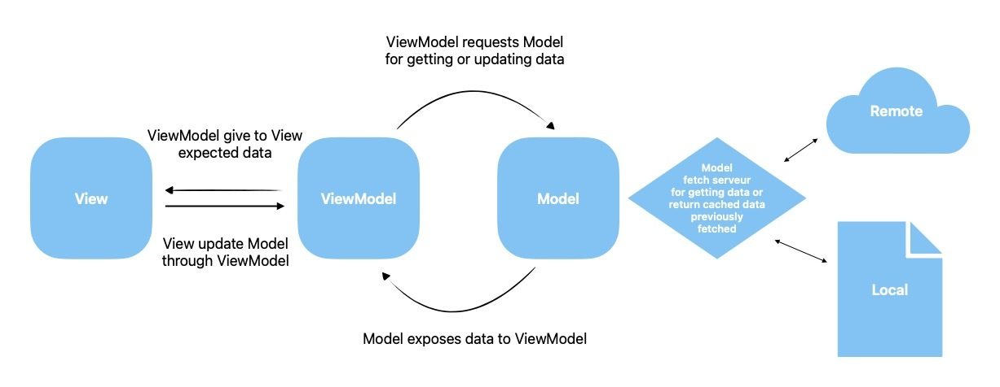

# Skot framewok project structure

A project contains six module : 

- androidApp : contains the application class.

- viewcontract : contains the contract of the views. Start point to create Screens or components
  
  [read more](viewcontract.md)

- viewmodel : contains the ViewModel of the views. 

  [read more](viewmodel.md)

- view : contains the view and its XML.

  [read more](view.md)

- modelcontract : contains the contract of the model.

  [read more](modelcontract.md)

- model : contains the model of the views, the businessModels, and all the code for network request
  
  [read more](model.md)

